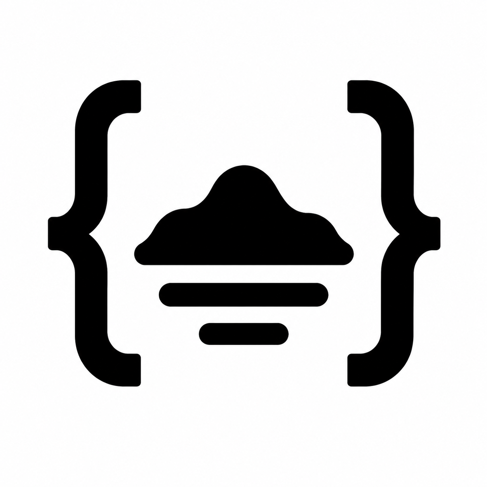

# CodexIsland

<p align="center">
  
</p>

> Your AI usage limits, living in your notch.

A floating macOS overlay that turns the MacBook notch into a Dynamic-Island-style live activity for Claude Code and Codex API rate limits.


## Why this exists

Claude Pro / Max and ChatGPT Plus / Pro both have hidden 5-hour and weekly token windows. Most people only learn they've hit a limit when they get blocked mid-task — and the warning that does fire usually surfaces deep in a CLI log. CodexIsland turns the notch into a living indicator so you always know where you stand: hover the notch, see both providers, both windows, both reset times.

## Features

- **Two providers, four windows.** Claude 5h + 7d, Codex 5h + 7d, all in one panel.
- **Five chart styles, your pick.** Ring · Bar · Stepped · Numeric · Sparkline. Cmd-click anywhere on the panel to cycle.
- **Lives in the notch.** Hover-to-expand; a black pill the size of the physical notch with a slow cobalt glow when collapsed.
- **Click-through everywhere else.** The window only steals focus when the cursor is over the visible silhouette.
- **No Dock icon, no menu, no preferences window.** It's the notch.
- **Launch at login.** Toggle it from the quiet utility icon in the expanded panel corner.
- **5-minute polling.** Anthropic's usage endpoint is heavily rate-limited per token; faster polling burns the quota in minutes.
- **Local only.** No telemetry, no analytics, no third-party API calls. Tokens read from your existing Claude / Codex installs.

## Install

**Homebrew (recommended):**

```sh
brew install --cask --no-quarantine codexisland
```

**Direct download.** Grab `CodexIsland-X.Y.Z.dmg` from [Releases](https://github.com/ericjypark/codex-island/releases), drag the app to /Applications, then run:

```sh
xattr -d com.apple.quarantine /Applications/CodexIsland.app
```

<details>
<summary>Why is the dequarantine command necessary?</summary>

CodexIsland is unsigned because Apple charges $99/year for a Developer ID certificate, and this is a free open-source project. The dequarantine command strips the macOS Gatekeeper attribute that triggers the "cannot be opened because Apple cannot check it for malicious software" warning. The source code is all here — feel free to audit it before running. If a sponsored Apple Developer ID becomes available via [GitHub Sponsors](https://github.com/sponsors/ericjypark), signed builds will follow.
</details>

<details>
<summary>I refuse to touch the terminal. What do I do?</summary>

1. Drag `CodexIsland.app` to `/Applications`.
2. Try to open it. macOS refuses with "cannot be opened because Apple cannot check it for malicious software".
3. Open **System Settings → Privacy & Security**.
4. Scroll to the bottom — you'll see "CodexIsland was blocked..." with an **Open Anyway** button.
5. Click **Open Anyway**, then re-launch the app.
</details>

## Build from source

Requires macOS 26+ (Tahoe) and Swift 6.2+ (ships with Xcode 26 / `xcode-select --install` on a fresh macOS 26 system).

```sh
git clone https://github.com/ericjypark/codex-island
cd codexisland
./build.sh
open build/CodexIsland.app
```

There's no Xcode project — just `swiftc` over `Sources/**/*.swift`. To package a DMG: `npm install --global create-dmg && ./release.sh`.

## How it works

**Window.** Borderless `NSWindow` at level `.popUpMenu` so it draws above the system menu bar. Position is `screen.frame.maxY - height` (not `visibleFrame`), so the panel can extend up into the notch and menu-bar area. `.canJoinAllSpaces` + `.stationary` so it follows the user across spaces.

**Notch detection.** `screen.safeAreaInsets.top` gives the notch height; `screen.frame.width − auxiliaryTopLeftArea − auxiliaryTopRightArea` gives the width. Falls back to `200 × 28` on non-notched displays so the panel still has sensible dimensions.

**Click-through.** Two layers cooperate: `IslandHostingView.hitTest(_:)` returns `nil` outside the visible shape rect, and a global `NSEvent.mouseMoved` monitor toggles `window.ignoresMouseEvents` based on cursor position. The hitTest alone isn't enough — the window still steals focus on click before AppKit consults hit testing.

**Auth, the hard part.** Anthropic doesn't expose a usage endpoint for end users; the Claude Code CLI itself talks to `api.anthropic.com/api/oauth/usage` with a `claude-code/2.1.121` User-Agent and an `oauth-2025-04-20` beta header. Three token sources, in freshness order: `CLAUDE_CODE_OAUTH_TOKEN` env var, the `Claude Code-credentials` keychain item, then a refresh against `console.anthropic.com/v1/oauth/token`. Codex is easier — `chatgpt.com/backend-api/wham/usage` with the access token from `~/.codex/auth.json`.

**Polling.** 5-minute interval. Faster burns the per-token quota; the data is window-based (5h / 7d) so 30s polling has nothing to show for itself except a 429.

**Launch at login.** The corner utility control uses Apple's modern `SMAppService.mainApp` API. It is off until you enable it from the UI; CodexIsland does not silently register itself on install.

**Both endpoints are undocumented.** They will break. When that happens, file an issue.

## Privacy

- No telemetry, no analytics, no crash reporting.
- Auth tokens are read locally from `~/.codex/auth.json`, the macOS keychain, or the `CLAUDE_CODE_OAUTH_TOKEN` env var. They never leave your machine except as `Authorization` headers to `chatgpt.com` and `api.anthropic.com`.
- The app makes no other network calls. Open source code is the proof — `Sources/Usage/UsageFetcher.swift` is 200 lines.

## FAQ

**Why does Claude show "auth required"?**
Run `claude` once on the command line, or open Claude Desktop. Either populates the credentials CodexIsland reads.

**Why doesn't it work on my Mac without a notch?**
It does — falls back to a 200×28 pill in the menu-bar area. The notch is the visual anchor, not a hard requirement.

**Will it break when Anthropic / OpenAI change their APIs?**
Yes. Both endpoints are undocumented. File an issue and I'll update the User-Agent / beta header / parser.

**Why 5-minute polling? Can I change it?**
Anthropic rate-limits `/api/oauth/usage` aggressively per token. 30-second polling burns the daily quota in an afternoon. The constant is in `Sources/Usage/UsageStore.swift` if you want to experiment locally — please don't lower it in a PR.

**Why is it unsigned?**
Apple charges $99/year for a Developer ID and CodexIsland is free. The unsigned route is normal for OSS Mac apps (Rectangle, many menu-bar utilities). If you'd like to sponsor a signed build, [GitHub Sponsors](https://github.com/sponsors/ericjypark) is open.

**Does it support multiple monitors?**
The panel pins to `NSScreen.main` (the one with the active app). Multi-monitor users currently get one notch indicator on the primary display. PRs welcome.

## Acknowledgements

- [**codexbar**](https://github.com/steipete/codexbar) by Peter Steinberger — the auth-source archaeology that figured out the env-var → keychain → refresh ladder.
- [**claudecodeusage**](https://github.com/RchGrav/claudecodeusage) by Rich Hickson — surfaced the `claude-code/2.1.121` User-Agent requirement on `/api/oauth/usage`.
- [**LaunchAtLogin-Modern**](https://github.com/sindresorhus/LaunchAtLogin-Modern) by Sindre Sorhus — reference API shape for the `SMAppService.mainApp` launch-at-login toggle.
- [**Emil Kowalski**](https://animations.dev) — the strong ease-out curve, asymmetric morph springs, and the general "less ambient motion" discipline.

## License

MIT — see [LICENSE](LICENSE).
